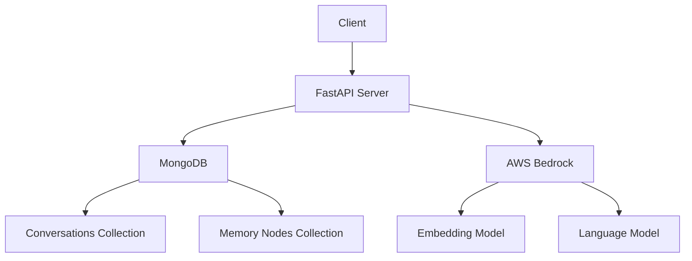

# AI Knowledge and Memory Service Documentation

## Table of Contents
1. [Overview](#1-overview)
2. [System Architecture](#2-system-architecture)
3. [Components](#3-components)
4. [Installation & Deployment](#4-installation--deployment)
5. [Configuration](#5-configuration)
6. [Usage](#6-usage)
7. [API Reference](#7-api-reference)
8. [Security Considerations](#8-security-considerations)
9. [Monitoring & Logging](#9-monitoring--logging)
10. [Troubleshooting](#10-troubleshooting)
11. [Development Guide](#11-development-guide)
12. [Maintenance & Operations](#12-maintenance--operations)

## 1. Overview

The AI Knowledge and Memory Service is a sophisticated system designed to enhance AI interactions by providing long-term memory and contextual understanding. It allows AI assistants to remember and recall information from past conversations, improving the continuity and personalization of interactions.

Key features include:
- Storage and retrieval of conversation history
- Generation of conversation summaries
- Semantic search capabilities
- Hierarchical memory storage with importance scoring
- Integration with AWS Bedrock for embeddings and language model interactions

## 2. System Architecture



The system consists of a FastAPI server that interacts with a MongoDB database for data storage and AWS Bedrock for AI capabilities. The MongoDB database contains two main collections: Conversations and Memory Nodes. AWS Bedrock provides embedding generation and language model services.

## 3. Components

```bash

├── main.py                  # FastAPI app initialization and API routes
├── config.py                # Configuration variables and constants
├── database/
│   ├── __init__.py
│   ├── mongodb.py           # MongoDB connection and initialization
│   └── models.py            # Database models and schema
├── services/
│   ├── __init__.py
│   ├── bedrock.py           # AWS Bedrock integration
│   ├── memory_service.py    # Memory operations
│   ├── conversation_service.py  # Conversation operations
│   └── embedding_service.py  # Embedding generation and vector operations
├── utils/
│   ├── __init__.py
│   └── helpers.py           # Utility functions
└── models/
    ├── __init__.py
    └── pydantic_models.py   # Pydantic models for requests/responses
```
### FastAPI Server
- Purpose: Handles HTTP requests and orchestrates the system's operations
- Technologies: Python, FastAPI
- Interactions: Communicates with MongoDB and AWS Bedrock

### MongoDB Database
- Purpose: Stores conversation history and memory nodes
- Collections:
  - Conversations: Stores individual messages with vector embeddings
  - Memory Nodes: Stores hierarchical memory structures with importance scoring
- Interactions: Queried by the FastAPI server for data retrieval and storage

### AWS Bedrock Integration
- Purpose: Provides AI capabilities for embedding generation and language understanding
- Services Used:
  - Embedding Model: Generates vector representations of text
  - Language Model: Performs text generation tasks like summarization

### Memory Service
- Purpose: Manages the creation, updating, and pruning of memory nodes
- Key Functions:
  - Importance scoring of new memories
  - Merging similar memories
  - Pruning less important memories to maintain a manageable memory tree

### Conversation Service
- Purpose: Handles the storage and retrieval of conversation history
- Key Functions:
  - Adding new messages to conversations
  - Performing hybrid searches (combining semantic and full-text search)
  - Generating conversation summaries

## 4. Installation & Deployment

1. Clone the repository:
   ```
   git clone [repository-url]
   cd ai-memory
   ```

2. Install dependencies:
   ```
   pip install -r requirements.txt
   ```

3. Set up environment variables (see Configuration section)

4. Run the FastAPI server:
   ```
   python main.py
   ```

For containerized deployment:

1. Build the Docker image:
   ```
   docker build -t ai-memory-service .
   ```

2. Run the container:
   ```
   docker run -p 8182:8182 -e MONGODB_URI=your_mongodb_uri -e AWS_ACCESS_KEY_ID=your_key -e AWS_SECRET_ACCESS_KEY=your_secret ai-memory-service
   ```

## 5. Configuration

Configure the application using environment variables or a `.env` file:

- `MONGODB_URI`: MongoDB connection string
- `AWS_ACCESS_KEY_ID`: AWS access key for Bedrock
- `AWS_SECRET_ACCESS_KEY`: AWS secret key for Bedrock
- `AWS_REGION`: AWS region for Bedrock services
- `SUMMARY_MODEL_ID`: Bedrock model ID for summarization
- `EMBEDDING_MODEL_ID`: Bedrock model ID for embedding generation

Additional configuration constants are defined in `config.py`:

- `MAX_DEPTH`: Maximum depth of the memory tree
- `SIMILARITY_THRESHOLD`: Threshold for considering memories similar
- `DECAY_FACTOR`: Factor for decaying importance of memories
- `REINFORCEMENT_FACTOR`: Factor for reinforcing important memories

## 6. Usage

The service exposes two main endpoints:

1. Adding a message to a conversation:
   ```python
   client.add_message(
       conversation_id="conversation_1",
       text="Hello, how can I help you today?",
       message_type="ai"
   )
   ```

2. Retrieving memory based on a query:
   ```python
   memory_info = client.retrieve_memory("What did we discuss about Japan?")
   ```

## 7. API Reference

### POST /conversation/
Add a message to the conversation history.

Request Body:
```json
{
  "user_id": "string",
  "conversation_id": "string",
  "type": "human" or "ai",
  "text": "string",
  "timestamp": "string" (optional)
}
```

### GET /retrieve_memory/
Retrieve memory items, context, summary, and similar memory nodes.

Query Parameters:
- `user_id`: string
- `text`: string (query text)

## 8. Security Considerations

- Ensure proper authentication and authorization for API access
- Use HTTPS for all communications
- Regularly rotate AWS credentials
- Implement rate limiting to prevent abuse
- Sanitize and validate all user inputs

## 9. Monitoring & Logging

- Use AWS CloudWatch for monitoring Bedrock usage
- Implement application-level logging for server operations
- Monitor MongoDB performance and usage
- Set up alerts for error rates and API response times

## 10. Troubleshooting

Common issues and solutions:
- Connection errors to MongoDB: Check network connectivity and MongoDB URI
- AWS Bedrock errors: Verify AWS credentials and region settings
- High latency: Monitor MongoDB query performance and optimize indexes

## 11. Development Guide

Key files and their purposes:
- `main.py`: FastAPI application entry point
- `config.py`: Configuration constants and environment variable loading
- `services/conversation_service.py`: Conversation-related operations
- `services/memory_service.py`: Memory management operations
- `services/bedrock.py`: AWS Bedrock integration
- `database/mongodb.py`: MongoDB connection and initialization
- `models/pydantic_models.py`: Data models for API requests and responses

To extend the system:
1. Add new endpoints in `main.py`
2. Implement corresponding service functions in appropriate service files
3. Update data models in `pydantic_models.py` if needed
4. Add new configuration options to `config.py` if required

## 12. Maintenance & Operations

Regular maintenance tasks:
- Monitor and optimize MongoDB indexes
- Review and adjust memory pruning parameters based on system performance
- Keep dependencies updated, especially FastAPI and boto3
- Regularly backup the MongoDB database
- Monitor AWS Bedrock usage and costs

Long-term considerations:
- Evaluate the need for data archiving strategies as the system grows
- Consider implementing a caching layer for frequently accessed memories
- Explore multi-region deployment for improved latency and redundancy